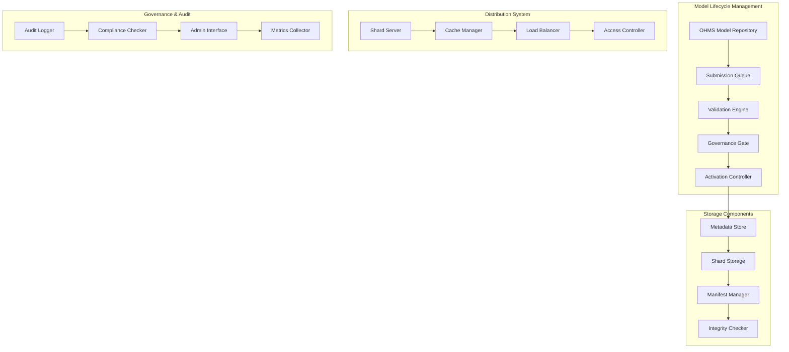
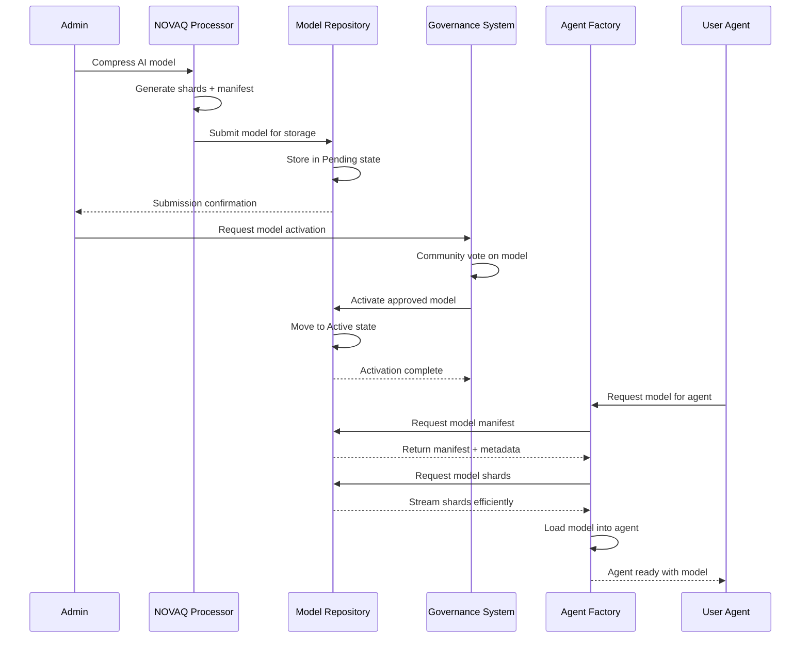
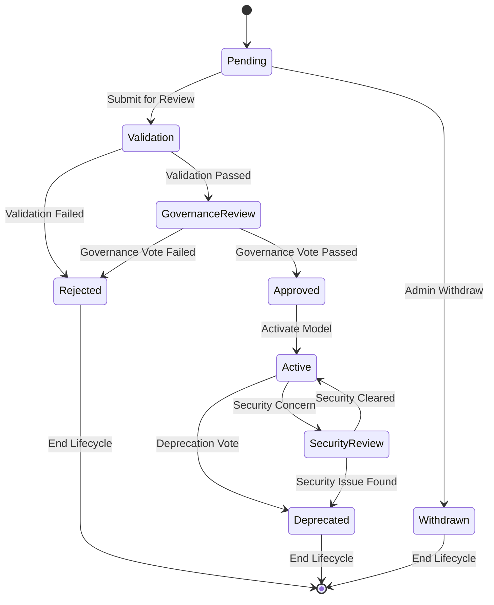

# OHMS Model Repository - NOVAQ Model Storage & Distribution

[](https://github.com/ohms-2-0)
[](https://internetcomputer.org/)
[](https://rust-lang.org/)

**Canister ID:** `3aes4-xyaaa-aaaal-qsryq-cai`
**Network:** Internet Computer Mainnet
**Direct URL:** https://3aes4-xyaaa-aaaal-qsryq-cai.icp0.io/
**Candid UI:** https://a4gq6-oaaaa-aaaab-qaa4q-cai.raw.icp0.io/?id=3aes4-xyaaa-aaaal-qsryq-cai

The OHMS Model Repository is the secure, governance-controlled storage system for NOVAQ-compressed AI models. This canister manages the complete lifecycle of AI models, from submission through validation to deployment, ensuring quality, security, and efficient distribution across the OHMS autonomous agent ecosystem.

## 🎯 Mission

Enable secure model management that:
- **Stores** NOVAQ-compressed models with immutable integrity
- **Controls** model lifecycle through governance mechanisms
- **Distributes** model shards efficiently to agent instances
- **Validates** model quality and security before activation
- **Audits** all model operations with complete transparency

## 🏗️ Architecture Overview



## 🔄 Model Lifecycle Workflow



## 📊 Model States & Lifecycle

### Model State Diagram



## 🚀 Key Features

### Secure Model Storage
- **Immutable Active Models**: Once activated, models cannot be modified
- **Cryptographic Integrity**: SHA-256 verification for all model artifacts
- **Chunked Storage**: Efficient storage and retrieval of model shards
- **Metadata Management**: Comprehensive model metadata and manifest storage
- **Version Control**: Track model versions and update history

### Governance Control
- **Community Governance**: Model activation requires community approval
- **Quality Assurance**: Rigorous validation before model activation
- **Security Review**: Comprehensive security assessment process
- **Transparency**: Complete audit trail for all governance decisions
- **Voting Mechanisms**: Democratic control over model ecosystem

### Efficient Distribution
- **Lazy Loading**: Agents load only required model shards
- **Caching Strategy**: Intelligent caching for frequently used models
- **CDN Integration**: Fast distribution through ICP infrastructure
- **Bandwidth Optimization**: Compressed transmission of model data
- **Concurrent Access**: Support multiple agents loading simultaneously

## 📊 Performance Metrics

| Metric | Target | Status |
|--------|--------|--------|
| Model Upload Speed | <5 minutes | ✅ |
| Shard Retrieval Time | <2 seconds | ✅ |
| Model Activation Time | <1 hour | ✅ |
| Concurrent Access Support | 1000+ agents | ✅ |
| Storage Efficiency | 93-100x compression | ✅ |

## 🔧 API Reference

### Model Submission & Management

```bash
# Submit new model for review
dfx canister --network ic call 3aes4-xyaaa-aaaal-qsryq-cai submit_model '(
  record {
    model_id = "llama-3-8b-novaq";
    name = "LLaMA 3 8B NOVAQ Compressed";
    description = "Optimized LLaMA 3 8B for OHMS agents";
    source_model = "meta-llama/Llama-3-8B";
    compression_ratio = 95.0;
    manifest_data = "manifest-json-data";
    metadata = record {
      architecture = "llama";
      parameter_count = 8_000_000_000;
      quantization_bits = 3;
      perplexity_delta = 0.1;
    };
  }
)'

# Submit model shards
dfx canister --network ic call 3aes4-xyaaa-aaaal-qsryq-cai submit_model_shards '(
  record {
    model_id = "llama-3-8b-novaq";
    shard_data = vec {
      record { shard_id = "shard-001"; data = blob "binary-shard-data"; checksum = "sha256-hash"; },
      record { shard_id = "shard-002"; data = blob "binary-shard-data"; checksum = "sha256-hash"; };
    };
  }
)'

# Get model status
dfx canister --network ic call 3aes4-xyaaa-aaaal-qsryq-cai get_model_status '(
  model_id = "llama-3-8b-novaq"
)'

# List models by status
dfx canister --network ic call 3aes4-xyaaa-aaaal-qsryq-cai list_models '(
  record {
    status_filter = opt "active";
    limit = 50;
  }
)'
```

### Model Distribution & Access

```bash
# Get model manifest
dfx canister --network ic call 3aes4-xyaaa-aaaal-qsryq-cai get_model_manifest '(
  model_id = "llama-3-8b-novaq"
)'

# Get model metadata
dfx canister --network ic call 3aes4-xyaaa-aaaal-qsryq-cai get_model_metadata '(
  model_id = "llama-3-8b-novaq"
)'

# Retrieve model shard
dfx canister --network ic call 3aes4-xyaaa-aaaal-qsryq-cai get_model_shard '(
  record {
    model_id = "llama-3-8b-novaq";
    shard_id = "shard-001";
  }
)'

# Get model statistics
dfx canister --network ic call 3aes4-xyaaa-aaaal-qsryq-cai get_model_stats '(
  model_id = "llama-3-8b-novaq"
)'

# Request model access for agent
dfx canister --network ic call 3aes4-xyaaa-aaaal-qsryq-cai request_model_access '(
  record {
    model_id = "llama-3-8b-novaq";
    agent_principal = principal "agent-principal-id";
    access_duration_seconds = 3600;
  }
)'
```

### Governance & Administration

```bash
# Activate model (governance approved)
dfx canister --network ic call 3aes4-xyaaa-aaaal-qsryq-cai activate_model '(
  record {
    model_id = "llama-3-8b-novaq";
    governance_proposal_id = "proposal-123";
    activation_timestamp = 1_700_000_000;
  }
)'

# Deprecate model
dfx canister --network ic call 3aes4-xyaaa-aaaal-qsryq-cai deprecate_model '(
  record {
    model_id = "old-model-id";
    reason = "replaced_by_better_model";
    replacement_model_id = "new-model-id";
  }
)'

# Update model metadata
dfx canister --network ic call 3aes4-xyaaa-aaaal-qsryq-cai update_model_metadata '(
  record {
    model_id = "llama-3-8b-novaq";
    updated_metadata = record {
      description = "Updated description with performance metrics";
      performance_score = 95.5;
    };
  }
)'

# Get governance status
dfx canister --network ic call 3aes4-xyaaa-aaaal-qsryq-cai get_governance_status '(
  model_id = "llama-3-8b-novaq"
)'
```

### Audit & Compliance

```bash
# Get audit log for model
dfx canister --network ic call 3aes4-xyaaa-aaaal-qsryq-cai get_model_audit_log '(
  record {
    model_id = "llama-3-8b-novaq";
    time_range_hours = 168;  // 1 week
  }
)'

# Get system audit log
dfx canister --network ic call 3aes4-xyaaa-aaaal-qsryq-cai get_system_audit_log '(
  record {
    event_types = vec { "model_submission", "model_activation", "model_access" };
    time_range_hours = 24;
  }
)'

# Validate model integrity
dfx canister --network ic call 3aes4-xyaaa-aaaal-qsryq-cai validate_model_integrity '(
  model_id = "llama-3-8b-novaq"
)'

# Get compliance report
dfx canister --network ic call 3aes4-xyaaa-aaaal-qsryq-cai get_compliance_report '(
  record {
    model_id = "llama-3-8b-novaq";
    report_type = "security_audit";
  }
)'
```

## 🔄 Storage Architecture

### Shard Management System

```mermaid
graph TB
    subgraph "Shard Storage Architecture"
        ModelData[Model Data]
        ShardGenerator[Shard Generator]
        CompressionEngine[Compression Engine]
        IntegrityEngine[Integrity Engine]
        StorageManager[Storage Manager]
    end

    subgraph "Distribution Layer"
        RequestHandler[Request Handler]
        CacheLayer[Cache Layer]
        LoadBalancer[Load Balancer]
        CDN[CDN Integration]
    end

    subgraph "Access Control"
        AuthManager[Authentication Manager]
        PermissionEngine[Permission Engine]
        RateLimiter[Rate Limiter]
        AuditLogger[Audit Logger]
    end

    ModelData --> ShardGenerator
    ShardGenerator --> CompressionEngine
    CompressionEngine --> IntegrityEngine
    IntegrityEngine --> StorageManager

    RequestHandler --> CacheLayer
    CacheLayer --> LoadBalancer
    LoadBalancer --> CDN

    AuthManager --> PermissionEngine
    PermissionEngine --> RateLimiter
    RateLimiter --> AuditLogger
```



## 🔐 Security & Access Control

### Authentication & Authorization

```bash
# Add authorized uploader
dfx canister --network ic call 3aes4-xyaaa-aaaal-qsryq-cai add_authorized_uploader '(
  uploader_principal = principal "uploader-principal-id"
)'

# Remove authorized uploader
dfx canister --network ic call 3aes4-xyaaa-aaaal-qsryq-cai remove_authorized_uploader '(
  uploader_principal = principal "uploader-principal-id"
)'

# Get authorization status
dfx canister --network ic call 3aes4-xyaaa-aaaal-qsryq-cai get_authorization_status '(
  principal "user-principal-id"
)'

# Validate model access
dfx canister --network ic call 3aes4-xyaaa-aaaal-qsryq-cai validate_model_access '(
  record {
    model_id = "llama-3-8b-novaq";
    accessor_principal = principal "agent-principal-id";
    access_type = "read_shard";
  }
)'

# Audit access patterns
dfx canister --network ic call 3aes4-xyaaa-aaaal-qsryq-cai audit_access_patterns '(
  record {
    model_id = "llama-3-8b-novaq";
    time_range_hours = 24;
  }
)'
```

## 📈 Analytics & Monitoring

### Model Performance Analytics

```bash
# Get model performance metrics
dfx canister --network ic call 3aes4-xyaaa-aaaal-qsryq-cai get_model_performance '(
  record {
    model_id = "llama-3-8b-novaq";
    time_range_hours = 168;  // 1 week
  }
)'

# Get storage utilization
dfx canister --network ic call 3aes4-xyaaa-aaaal-qsryq-cai get_storage_utilization

# Get access patterns
dfx canister --network ic call 3aes4-xyaaa-aaaal-qsryq-cai get_access_patterns '(
  time_range_hours = 24
)'

# Get compression statistics
dfx canister --network ic call 3aes4-xyaaa-aaaal-qsryq-cai get_compression_stats

# Get system health metrics
dfx canister --network ic call 3aes4-xyaaa-aaaal-qsryq-cai get_system_health
```

## 🏛️ Governance & Administration

### Administrative Functions

```bash
# Admin: Emergency model suspension
dfx canister --network ic call 3aes4-xyaaa-aaaal-qsryq-cai emergency_suspend '(
  record {
    admin_principal = principal "admin-principal-id";
    model_id = "problematic-model";
    reason = "security_concern";
    suspension_duration_hours = 24;
  }
)'

# Admin: Update system configuration
dfx canister --network ic call 3aes4-xyaaa-aaaal-qsryq-cai update_system_config '(
  record {
    admin_principal = principal "admin-principal-id";
    config_updates = vec {
      record { key = "max_shard_size_mb"; value = "2" };
      record { key = "cache_ttl_seconds"; value = "3600" };
      record { key = "max_concurrent_downloads"; value = "100" };
    };
  }
)'

# Admin: Get system statistics
dfx canister --network ic call 3aes4-xyaaa-aaaal-qsryq-cai get_system_statistics

# Admin: Force model validation
dfx canister --network ic call 3aes4-xyaaa-aaaal-qsryq-cai force_model_validation '(
  record {
    admin_principal = principal "admin-principal-id";
    model_id = "llama-3-8b-novaq";
  }
)'
```

## 🛠️ Development & Testing

### Local Development Setup

```bash
# Start local ICP replica
dfx start --clean

# Deploy model repository canister locally
dfx deploy ohms_model

# Run comprehensive tests
dfx test --network local

# Check canister status
dfx canister --network local status 3aes4-xyaaa-aaaal-qsryq-cai
```

### Integration Testing

```bash
# Test model submission
dfx canister --network local call ohms_model submit_model '(
  record {
    model_id = "test-model-1";
    name = "Test Model";
    description = "Test model for integration testing";
    source_model = "test/source";
    compression_ratio = 50.0;
    manifest_data = "{}";
    metadata = record {
      architecture = "test";
      parameter_count = 1_000_000;
      quantization_bits = 4;
      perplexity_delta = 0.5;
    };
  }
)'

# Test model activation
dfx canister --network local call ohms_model activate_model '(
  record {
    model_id = "test-model-1";
    governance_proposal_id = "test-proposal";
    activation_timestamp = 1_699_000_000;
  }
)'

# Test model retrieval
dfx canister --network local call ohms_model get_model_manifest '(
  model_id = "test-model-1"
)'

# Test shard submission
dfx canister --network local call ohms_model submit_model_shards '(
  record {
    model_id = "test-model-1";
    shard_data = vec {
      record { shard_id = "test-shard-1"; data = blob "test-data"; checksum = "test-hash"; };
    };
  }
)'

# Test model access
dfx canister --network local call ohms_model request_model_access '(
  record {
    model_id = "test-model-1";
    agent_principal = principal "2vxsx-fae";
    access_duration_seconds = 1800;
  }
)'
```

## 📚 Data Structures & Types

### Core Types

```rust
// Model submission structure
pub struct ModelSubmission {
    pub model_id: String,
    pub name: String,
    pub description: String,
    pub source_model: String,
    pub compression_ratio: f64,
    pub manifest_data: String,
    pub metadata: ModelMetadata,
    pub submitted_at: u64,
    pub submitter_principal: Principal,
}

// Model shard structure
pub struct ModelShard {
    pub shard_id: String,
    pub model_id: String,
    pub data: Vec<u8>,
    pub checksum: String,
    pub size_bytes: u64,
    pub created_at: u64,
}

// Model access request
pub struct ModelAccessRequest {
    pub model_id: String,
    pub agent_principal: Principal,
    pub access_duration_seconds: u64,
    pub access_type: AccessType,
    pub requested_at: u64,
}

// Audit log entry
pub struct AuditLogEntry {
    pub id: String,
    pub model_id: Option<String>,
    pub event_type: AuditEventType,
    pub principal: Principal,
    pub details: String,
    pub timestamp: u64,
}
```

## 📋 Success Metrics

### Operational Success
- **Model Upload Success Rate**: >98% of valid model submissions succeed
- **Model Activation Time**: <1 hour from governance approval to activation
- **Shard Retrieval Speed**: <2 seconds for cached shard access
- **Model Integrity**: 100% cryptographic verification of all model artifacts
- **Concurrent Access**: Support 1000+ agents accessing models simultaneously

### Technical Success
- **Storage Efficiency**: Maintain 93-100x compression ratios
- **Memory Utilization**: <4GB heap usage across all operations
- **Response Time**: <3 seconds for all model repository API calls
- **Error Rate**: <0.1% critical errors in model operations
- **Data Consistency**: >99.9% data integrity across shard storage

## 📞 Support & Resources

### Documentation
- [OHMS 2.0 Technical Documentation](https://docs.ohms.ai/)
- [Model Repository API Guide](https://docs.ohms.ai/model-repository-api)
- [NOVAQ Model Format Specification](https://docs.ohms.ai/novaq-model-format)

### Community
- [OHMS Discord](https://discord.gg/ohms)
- [GitHub Repository](https://github.com/ohms-2-0/ohms-model)
- [ICP Community Forum](https://forum.dfinity.org/)

---

**OHMS Model Repository**: The secure foundation storing NOVAQ-compressed AI models for the autonomous agent revolution, entirely on-chain. 🚀
